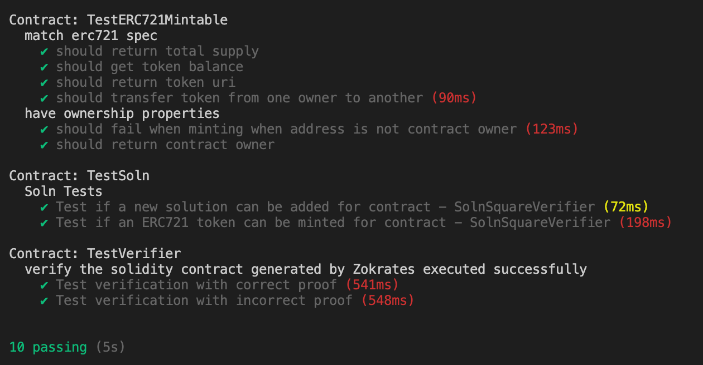
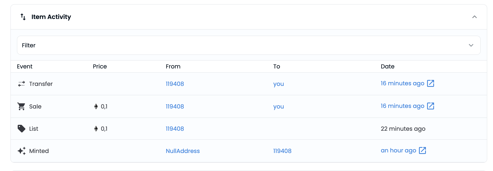

# Udacity Blockchain Capstone

The capstone was built upon the knowledge you have gained in the course in order to build a decentralized housing product.

## Requirements

- Truffle v5.5.24 (core: 5.5.24)Truffle v
- Solidity v0.5.16 (solc-js)
- Node v16.15.0
- Web3.js v1.7.4
- Ganache v7.4.0

## How to test the code

1. After having cloned the repository, install all depedencies thanks to `npm install`
2. Install the ganache-cli if it's not the case. When it's done, launch the local blockchain with `ganache-cli` cmd.
3. Please verify the requirement versions about solc, node and truffle versions and upgrade/downgrade each tool if needed.
4. Now you can launch the command `truffle test` to test the code.

## Transaction logs

### Deploying 'SolnSquareVerifier'

> transaction hash: 0x5aacaaa8ce5a878f0983e9583c5b2a82901605738681dbd887fca85ce64d0837
> Blocks: 1 Seconds: 12
> contract address: 0xF8561e4e1F1479CDE7b7B8f0e0eA75bb78732e07
> block number: 11177224
> block timestamp: 1660122498
> account: 0x1194084afb4e8b473210C535A6aE770ef09E323E
> balance: 2.973136294653211918
> gas used: 3283008 (0x321840)
> gas price: 2.500000025 gwei
> value sent: 0 ETH
> total cost: 0.0082075200820752 ETH

> Saving migration to chain.
> Saving artifacts

---

> Total cost: 0.0082075200820752 ETH

## URL of the storefront link

Opensea Marketplace : https://testnets.opensea.io/collection/real-estate-marketplace-du2qnzhkav

## Assets

### Tests passed

### Transactions about NFT-0 to NFT-4

## Project Resources

- [Remix - Solidity IDE](https://remix.ethereum.org/)
- [Visual Studio Code](https://code.visualstudio.com/)
- [Truffle Framework](https://truffleframework.com/)
- [Ganache - One Click Blockchain](https://truffleframework.com/ganache)
- [Open Zeppelin ](https://openzeppelin.org/)
- [Interactive zero knowledge 3-colorability demonstration](http://web.mit.edu/~ezyang/Public/graph/svg.html)
- [Docker](https://docs.docker.com/install/)
- [ZoKrates](https://github.com/Zokrates/ZoKrates)
